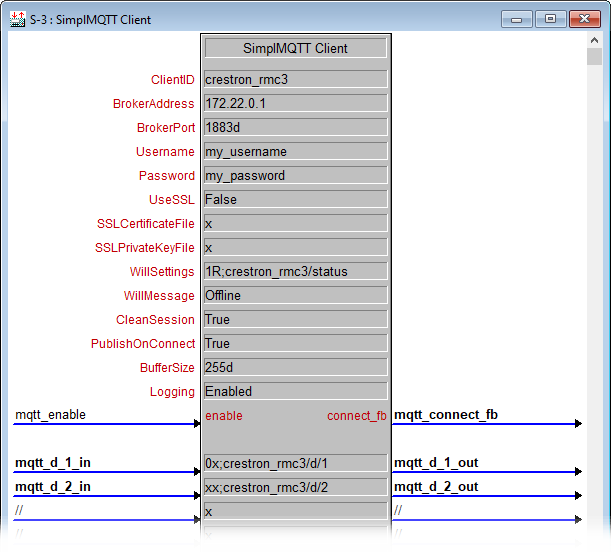

# SimplMQTT
This module provides a TCP client for publish/subscribe messaging through an MQTT broker.  It is provided as a SIMPL+ module (utilizing a SIMPL# library) for use in SIMPL Windows programs.

### Acknowledgements
SimplMQTT was forked from [sahajquinci](https://github.com/sahajquinci)'s *simplewmqttclient*, which - as far as I can tell - is the first open source MQTT client for SIMPL Windows.  If you find SimplMQTT useful and want to show your appreciation through a donation, please head to the [*simplewmqttclient*](https://github.com/sahajquinci/simplewmqttclient) repository and click the *donate* button at the bottom of the page there.  

### Usage

(More information will be added here eventually...)

### Warnings / Known Limitations
- This module has been tested exclusively against the [Eclipse Mosquitto](https://mosquitto.org/) broker (Version 1.6.3).

- SSL functionality from the original fork has been carried over, but remains untested.

- Messages can only be published at `QoS0`.  Subscriptions can be at `QoS0` or `QoS1`.  `QoS2` is not supported.